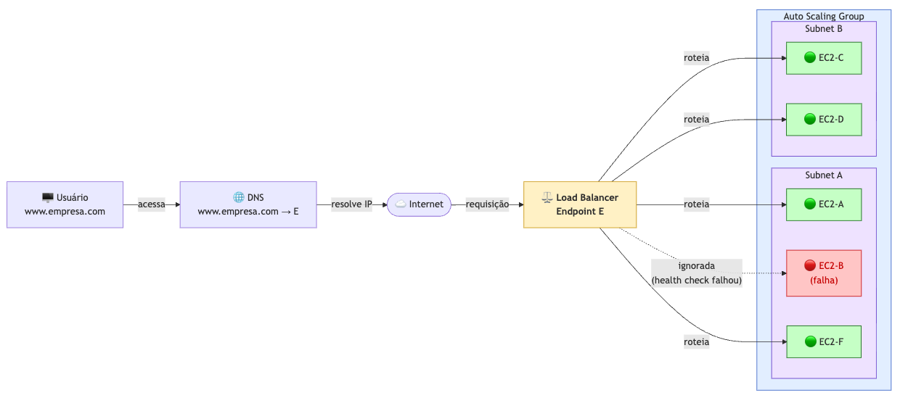
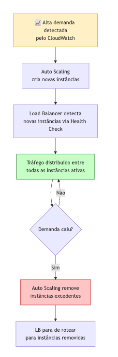

# Load Balancers — AWS

## O que é um Load Balancer?

Um **Load Balancer (LB)** é um componente de infraestrutura responsável por **distribuir o tráfego de rede** entre múltiplas instâncias de forma equilibrada. Ele atua como ponto único de entrada para os usuários, encaminhando as requisições para as instâncias disponíveis e saudáveis.

---

## Fluxo de uma requisição

**Passo a passo:**

1. O usuário acessa `www.empresa.com` no navegador
2. O **DNS** resolve o domínio para o endereço do Load Balancer (endpoint **E**)
3. O Load Balancer recebe a requisição e verifica quais instâncias estão **saudáveis**
4. A requisição é encaminhada para uma das instâncias disponíveis (A, F, C ou D)
5. A instância **B**, marcada como falha, é automaticamente ignorada pelo LB

---

## Componentes do diagrama

### Usuário
O cliente que acessa a aplicação pelo domínio `www.empresa.com`. Ele nunca se comunica diretamente com as instâncias — sempre passa pelo Load Balancer.

### DNS
Traduz o domínio `www.empresa.com` para o IP do Load Balancer. O usuário não precisa saber quantas instâncias existem nem seus IPs.

### Load Balancer (LB) — Endpoint E
Ponto central que:
- Recebe todo o tráfego externo
- Verifica a saúde das instâncias (Health Check)
- Distribui as requisições entre as instâncias ativas
- Ignora instâncias com falha automaticamente

### Instâncias EC2

| Instância | Status     | Recebe tráfego? |
|-----------|------------|-----------------|
| EC2-A     | ✅ Saudável | Sim             |
| EC2-B     | ❌ Com falha | Não (ignorada)  |
| EC2-F     | ✅ Saudável | Sim             |
| EC2-C     | ✅ Saudável | Sim             |
| EC2-D     | ✅ Saudável | Sim             |

### Auto Scaling Group
As instâncias estão dentro de um **Auto Scaling Group**, o que significa que o número de instâncias pode aumentar ou diminuir automaticamente conforme a demanda. O Load Balancer detecta e começa a rotear tráfego para novas instâncias automaticamente.

---

## Por que usar Load Balancer?

| Benefício                  | Descrição                                                                 |
|----------------------------|---------------------------------------------------------------------------|
| **Alta disponibilidade**   | Se uma instância cair, o tráfego é redirecionado automaticamente          |
| **Escalabilidade**         | Funciona junto com o Auto Scaling para lidar com picos de tráfego         |
| **Ponto único de entrada** | O usuário acessa sempre o mesmo domínio, independente de quantas instâncias existem |
| **Health Check**           | Monitora continuamente a saúde das instâncias e remove as com falha do pool |
| **Distribuição de carga**  | Evita que uma única instância fique sobrecarregada                        |

---

## Tipos de Load Balancer na AWS (ELB)

| Tipo                              | Camada OSI | Casos de uso                                    |
|-----------------------------------|------------|-------------------------------------------------|
| **ALB** (Application Load Balancer) | Camada 7  | HTTP/HTTPS, roteamento por path ou host         |
| **NLB** (Network Load Balancer)   | Camada 4   | TCP/UDP, altíssima performance e baixa latência |
| **GLB** (Gateway Load Balancer)   | Camada 3   | Appliances de segurança (firewalls, IDS/IPS)    |

---

## Integração com Auto Scaling

O Load Balancer e o Auto Scaling trabalham juntos de forma complementar:

Quando uma instância é **removida** pelo Auto Scaling (scale in), o Load Balancer para de enviar tráfego para ela antes da finalização — garantindo que nenhuma requisição seja perdida.

---

## Resumo

> O Load Balancer é o **porteiro inteligente** da sua aplicação: recebe todos os visitantes, verifica quem está disponível para atendê-los e distribui o fluxo de forma eficiente — garantindo que nenhuma instância fique sobrecarregada e que falhas passem despercebidas pelo usuário final.
